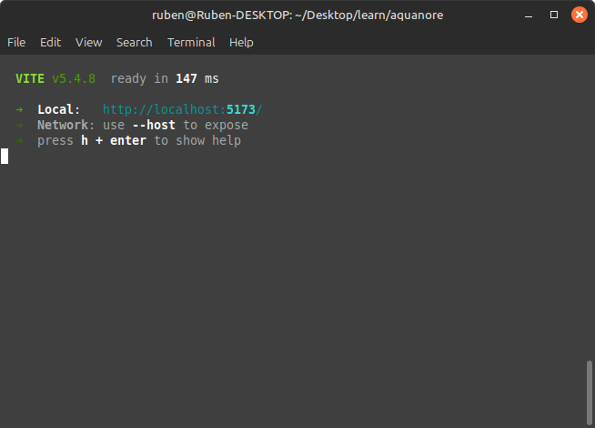
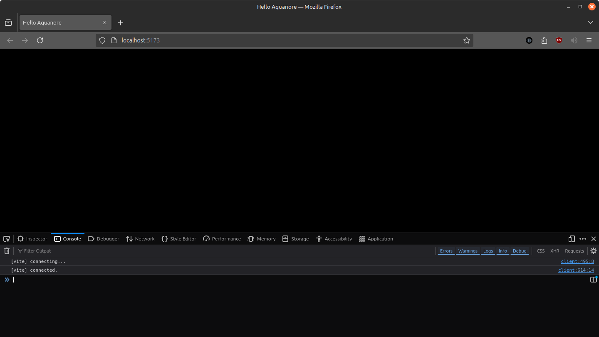

# Aquanore Documentation

## Table of contents
1. [Installation](#installation)
2. [Tutorials](#tutorials)
   1. [Hello Aquanore](#hello-aquanore)

## Installation
### NPM
```
npm install aquanore
```

## Tutorials
### Hello Aquanore
#### Empty project
Let's begin by creating an empty folder and setting up a node project in it. For this tutorial I will provide the package.json contents but you can also just run `npm init` followed by `npm install --save aquanore` and `npm install --save-dev vite`. The result will be more or less the same. 

We are going to use TypeScript as the language and Vite as our build tool. Vite can be used both as webserver to serve the ts files while you are working on them as well as the build tool that generates a dist folder with all the html, css and js files. Our tutorial does not require extra configuration per se but you can always add a `vite.config.ts` file should you like to make changes.

package.json
```json
{
  "name": "hello",
  "version": "1.0.0",
  "author": "",
  "license": "ISC",
  "description": "",
  "dependencies": {
    "aquanore": "^1.0.0"
  },
  "devDependencies": {
    "vite": "^5.4.8"
  }
}
```

> After you created the package.json file, do not forget to run `npm install`!

#### index.html
Now we got our folder, let's create a very basic index.html that will work both on desktop as on mobile. Create this file in the root folder of your project. Meaning, in the same folder as where package.json is located.

index.html
```html
<!DOCTYPE html>
<html>
<head>
    <title>Hello Aquanore</title>
    <meta charset="UTF-8" />
    <meta name="viewport" content="width=device-width,height=device-height,initial-scale=1.0" />

    <style>
        * {
            box-sizing: border-box;
            margin: 0;
            padding: 0;
        }

        html, body {
            width: 100%;
            height: 100%;
            overflow: hidden;
        }
    </style>
</head>
<body>
<script src="src/game.ts" type="module"></script>
</body>
</html>
```

It is as basic as it can get. The meta viewport will ensure our game will scale nicely on mobile displays and the embedded stylesheet will make sure our canvas has no white borders and the page will not contain scrollbars.

#### src/game.ts
Finally, let's add the game ts file itself and our basic project structure is complete! Create a folder `src` and create a new typescript file called `src/game.ts`. Then, open it and paste the following code into it.

```ts
import {Aquanore, AquanoreOptions} from "aquanore";

const options = new AquanoreOptions();
Aquanore.init(options);

Aquanore.onLoad = () => {

};

Aquanore.onUpdate = (deltaTime) => {

};

Aquanore.onRender = () => {

};

Aquanore.run();
```

#### Let's serve
Now we have our basic project template, let's run it to see how it works. Open a terminal in the root folder and run `npx vite`. If all went well you will see the following message:



If you click on the link you should get a black screen with nothing in it. And if you open the developer tools (in my case in FireFox I just press F12) you should see a console log mentioning vite is running. If this is the case, congratz! You just got your first empty game project up and running!



To make it easier for you I already provided a [template](../template/) folder in the root of this repository. You can always just use that folder.