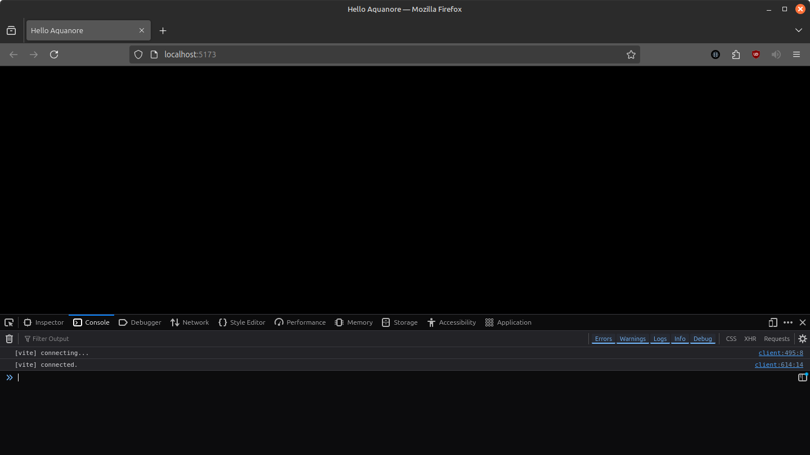

# Getting Started
> **Tip!** You can use the [template](../src/examples/template/) folder to get started as well. This section just covers the setup if you like to do it from scratch.

## Installation
```shell
npm install aquanore
```

## Setup
### index.html
Let's start by creating a very basic index.html with some basic css that will work both on desktop as on mobile. Create this file in the root folder of your project.

index.html
```html
<!DOCTYPE html>
<html>
<head>
    <title>Hello Aquanore</title>
    <meta charset="UTF-8" />
    <meta name="viewport" content="width=device-width,height=device-height,initial-scale=1.0" />

    <style>
        * {
            box-sizing: border-box;
            margin: 0;
            padding: 0;
        }

        html, body {
            width: 100%;
            height: 100%;
            overflow: hidden;
        }
    </style>
</head>
<body>
<script src="src/game.ts" type="module"></script>
</body>
</html>
```

The meta viewport will ensure our game will scale nicely on mobile displays and the embedded stylesheet will make sure our canvas has no white borders and the page will not contain scrollbars.

### src/game.ts
Finally, let's add the game ts file itself and our basic project structure is complete! Create a folder `src` and create a new typescript file called `src/game.ts`. Then, open it and paste the following code into it.

```ts
import { Aquanore } from "aquanore";

// Run this to initialize Aquanore with everything
Aquanore.init();

Aquanore.onLoad = async () => {
    // Load assets and initialize game states
};

Aquanore.onUpdate = async (dt: number) => {
    // Update objects or simulate physics.
};

Aquanore.onRender2D = async () => {
    // Render sprites, polygons and fonts
};

Aquanore.onRender3D() = async () => {
    // Render models
};

// Start the main loop
Aquanore.run();
```

### Let's serve
Now we have our basic project template, let's run it to see how it works. Open a terminal in the root folder and run `npx vite`. Open your browser and navigate to http://localhost:5173/. If all went well you should see an empty black screen without errors in the console. If this is the case, congratz! You just got your first empty game project up and running!

